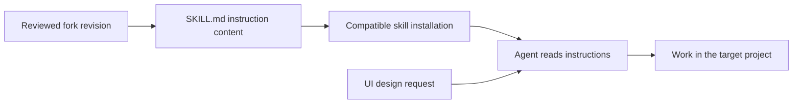

# Skill distribution and use

As-is source baseline: `d147f82c3a8957d7aa0077415a27d55c2b24e973`. Reviewed on 2026-09-17. This describes repository implementation, not verified live deployment state.

This fork contains instructions consumed by an agent, not an application runtime. Upstream authorship and installation guidance remain in the root README.

## Current architecture and data flow

The instruction document is the integration artifact. Installation selects a repository revision; a compatible agent reads that content while working in another project. This repository itself does not serve requests, store user data or deploy the resulting UI.

## Source evidence

- [skills/interfaces-that-feel/SKILL.md](../../skills/interfaces-that-feel/SKILL.md)
- [README.md](../../README.md)

## Change planning and maintenance

Before planning, read this map and the [project guide](../PROJECT.md), then inspect the linked implementation. For a significant change, add an explicitly labeled **to-be proposal** under this directory or in the design document, link it here, and show the affected boundaries and data flow. Keep proposed behavior separate from this as-is map. Update the current map, source links and review baseline in the same change that implements the behavior; retire or reconcile the proposal after implementation.

The [documentation deployment workflow](../deployment-documentation.md) defines the repository checks and reporting boundary. A structural check can identify missing or changed documentation, but cannot establish that a diagram matches runtime behavior. Human/code review must verify arrows, ownership, persistence and external dependencies.

Diagram maintenance uses `.nexus/diagrams.json` and `scripts/check-diagrams.py`. After reviewing the staged source changes against this map, update the source fingerprint with the shared checker and stage the metadata. The fingerprint records a review boundary, not semantic proof. Nexus tracks source changes and can open refresh PRs through the development/review workflow; updates remain reviewable PR changes, not assumed automatic merges.
